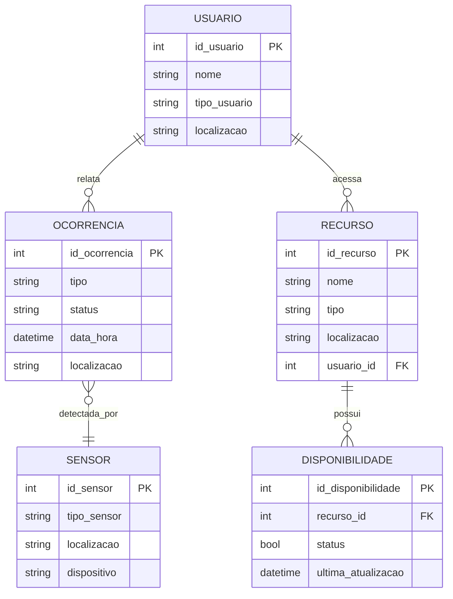

```mermaid
erDiagram

 
  
  OCORRENCIA     }o--|| SENSOR         : detectada_por

  USUARIO        ||--o{ OCORRENCIA     : relata
  USUARIO        ||--o{ RECURSO        : acessa
  
  RECURSO        ||--o{ DISPONIBILIDADE: possui

  

  OCORRENCIA {
    int       id_ocorrencia    PK
    string    tipo
    string    status
    datetime  data_hora
    string    localizacao
  }

  SENSOR {
    int     id_sensor        PK
    string  tipo_sensor
    string  localizacao
    string  dispositivo
  }

 USUARIO {
    int     id_usuario       PK
    string  nome
    string  tipo_usuario
    string  localizacao
  }

  RECURSO {
    int     id_recurso       PK
    string  nome
    string  tipo
    string  localizacao
    int     usuario_id       FK
  }

  DISPONIBILIDADE {
    int       id_disponibilidade  PK
    int       recurso_id          FK
    bool      status
    datetime  ultima_atualizacao
  }

 
```
